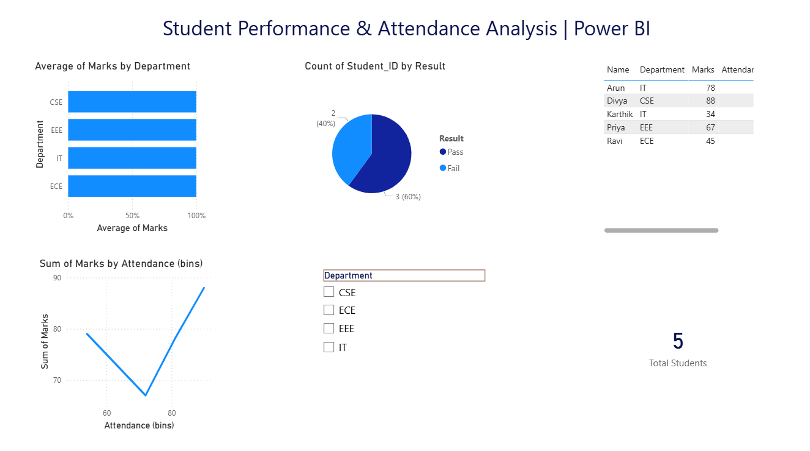

# Student Performance & Attendance Analysis (Power BI)

## 📊 Project Overview
This project analyzes student performance and attendance data using **Power BI** to uncover patterns, trends, and actionable insights that help understand academic outcomes.

---

## 🛠 Tools & Technologies
- Power BI
- Power Query
- DAX (Basic)
- Excel (Dataset)

---

## 📈 Key Insights
- Comparison of average marks across departments
- Impact of attendance on student performance
- Pass vs Fail distribution
- Interactive filters for department-wise analysis

---

## 🖼 Dashboard Preview

---

## 📂 Dataset
Academic dataset containing:
- Student ID
- Department
- Marks
- Attendance
- Result (Pass/Fail)

---

## 🎯 What I Learned
- Building interactive dashboards
- Data cleaning using Power Query
- Creating calculated measures
- Presenting insights visually for decision-making

---

## 🔗 Author
**Priyanga S**  
Aspiring Data Analyst | Python | SQL | Power BI
